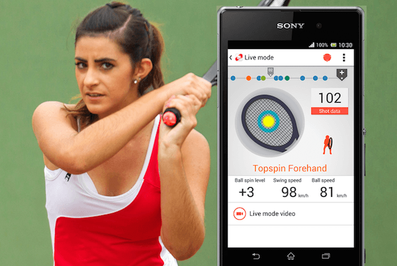

# APIってなんだ?
株式会社ギブリー IT研修  
新田章太

## はじめに

### 背景
- 社内でよく聞く「API」
- でも、ぶっちゃけどういった仕組みになっているかよくわからん

### この研修の対象
* 非エンジニア
* APIという言葉について理解をしたい人

### 諸注意
* 初心者の方にもわかりやすいように丁寧に説明をしております
* ほとんど概念的な要素が多いです

## そもそもAPIとは?

### [API 【 Application Programming Interface 】](http://e-words.jp/w/API.html)
こちらそのまま参照します。

あるコンピュータプログラム(ソフトウェア)の機能や管理するデータなどを、外部の他のプログラムから呼び出して利用するための手順やデータ形式などを定めた規約のこと。

個々のソフトウェアの開発者が毎回すべての機能をゼロから開発するのは困難で無駄が多いため、多くのソフトウェアが共通して利用する機能は、OSやミドルウェアなどの形でまとめて提供されている。

そのような汎用的な機能を呼び出して利用するための手続きを定めたものがAPIで、個々の開発者はAPIに従って機能を呼び出す短いプログラムを記述するだけで、自分でプログラミングすることなくその機能を利用したソフトウェアを作成することができる。

([REST API](http://e-words.jp/w/RESTful_API.html)については次回でもう少し深堀りします。)

## とりあえずわかりやすく人間の体で表現してみる
* 逆に解りづらかったらすみません。。。
* 医学には精通しておりませんので、あくまでなんとなくのイメージとして捉えていただけると嬉しいです。笑

### 脳みそ ＝ Webサーバ/計算機
* Webサーバはサービスにおいて脳みその機能を持ちます。
* 脳みそにはアルゴリズムやロジックが記載されていて、あらゆる計算、処理をおこないます。
* 最近はサーバ上の「人口知能」なんてものも多く存在しているので、まあそのまんまですね。

### 脊髄 = API
* APIはサービスにおいて脊髄の働きをします。
* 簡単にいうと、あらゆる刺激（Request）に応じて、反射(Response)をします。
* 「アツ！！と感じたら、とりあえず触ってるものから離れる」という一連の動作を定めたものがAPIです。
* APIの一連の流れをドキュメントにしたものが「API仕様」です。

### 身体 ＝ アプリケーション
* 実際に反射(Response)を受け取って表現をするのがフロントエンドなんじゃないかなって思います。
* 「アツっと感じたのでとりあえずものから離れなさい」という反射を受け取ることによって手が動きます。

(画像はイメージです。なんとなくこんな感じのイメージ。)

## 「API共有・公開」とは

### API共有=脳みそと脊髄を共有すること（グロい）

### 具体的には
- 登録されているデータの利用
- サービス特有の機能の利用

**APIを利用する=これらの機能を使うこと**

## どのように使うのか

### 1.アクセストークンの発行(身分証明)

### 2.APIの利用

## なぜいまAPIが重要なのか
* 脊髄が重要なのはなんとなくイメージが湧くと思うのですが、以前は脳みそと身体を開発するのに力を入れていました。
* それが5年ぐらいでAPIの重要性が見直されるようになってきています。

### 1.フロントエンド開発の多様化
- 近年のフロントエンド開発の多様化が、APIの重要性が増してきています。
- 先ほどの例で例えると、人間の身体の動かし方や感じ方が多様化している、といったところでしょうか。

### 具体的な例
- スマフォアプリ×Webブラウザ同時開発

### 参考のブログ
[Railsが時代に合わなくなってきた](http://qiita.com/kaiinui/items/2781219340d427543d08)

### Webサーバ = APIサーバの構築

### 2.IoTの普及(脳みそ搭載のデバイス)

[IoT(Internet of Things)](http://e-words.jp/w/IoT.html)の展開
- 様々なデバイス
- またそれを制御する周辺機器が増えた

### 事例

* RaspberryPI、インテルEdison等の超小型コンピュータの普及

[APIでつながるIoT(Internet of Things)の世界！ API Meetup Tokyo！#4 参加レポート](http://dev.classmethod.jp/study_meeting/api-meetup-tokyo-4/)  

### 3.APIの公開

誰でもが自社サービスのデータ・機能を利用することができるようになること

[オープンイノベーション](http://ja.wikipedia.org/wiki/%E3%82%AA%E3%83%BC%E3%83%97%E3%83%B3%E3%82%A4%E3%83%8E%E3%83%99%E3%83%BC%E3%82%B7%E3%83%A7%E3%83%B3)

人間で例えると、皆で脳みそを共有してもっと賢い人間をつくっていこう！といった取り組み。

ある数学の公式を覚えている脳みそが存在するのであれば、自分自身はその人の脳みそに脊髄経由で問い合わせ(Request)をすることが出来て答えを得ることができるので、わざわざ自分自身が公式を覚える必要がなくなりました。

### 具体例
* GoogleやFacebookをはじめとしたプラットフォームサービスがAPIを公開
* 人工知能、音声認識など、自前では得られない特化型のAPIも利用可能に
* APIを活用したハッカソンなど、第三者への機会提供の取り組みの増加

* [日本の全エンジニアに捧ぐ！現在公開されているAPI一覧【2013年版】](http://www.find-job.net/startup/api-2013)
* [【2014年度版】すべてのビジネスマンに役立つAPI一覧](http://keiei.freee.co.jp/2014/07/10/api/)

## まとめ

1.APIとは、Webサービスにおける人間でいうと脊髄のような働きをするインターフェイスの事

2.API共有・公開＝脳みそ&脊髄の共有・公開

3.APIの重要性が徐々に高まってきています

全体のイメージとしては、このような感じです。
下部がIoTの促進の部分で、上部がオープンイノベーションの部分を表現しています。

この図をみれば、API仕様が重要になってきていることは一目瞭然かと思います。

今は様々なAPIとデバイスを組み合わせて、誰でも幅広いサービスを簡単に作ることが可能になってきています。
